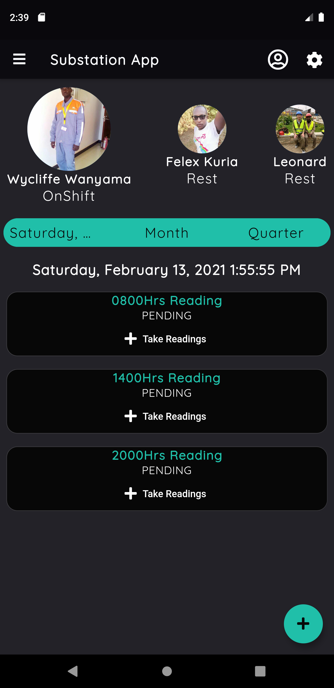
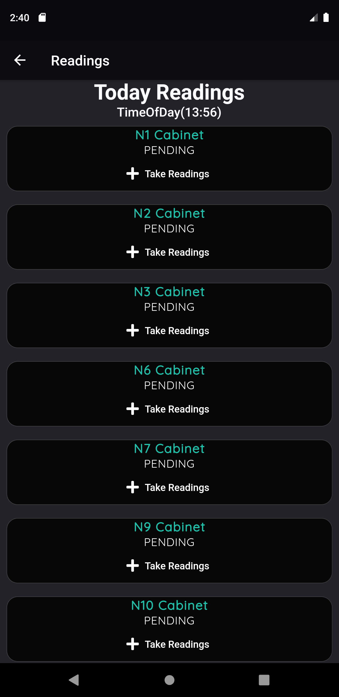
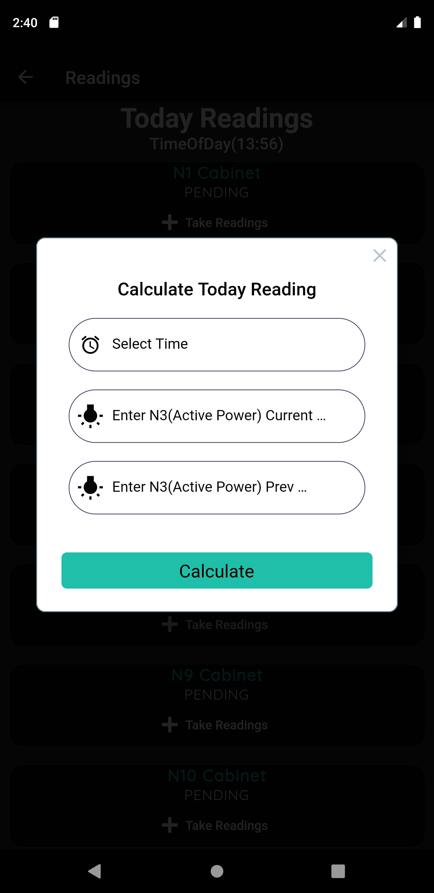
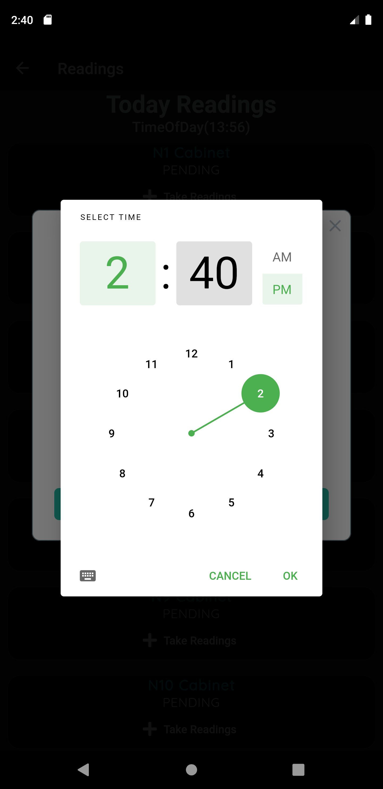
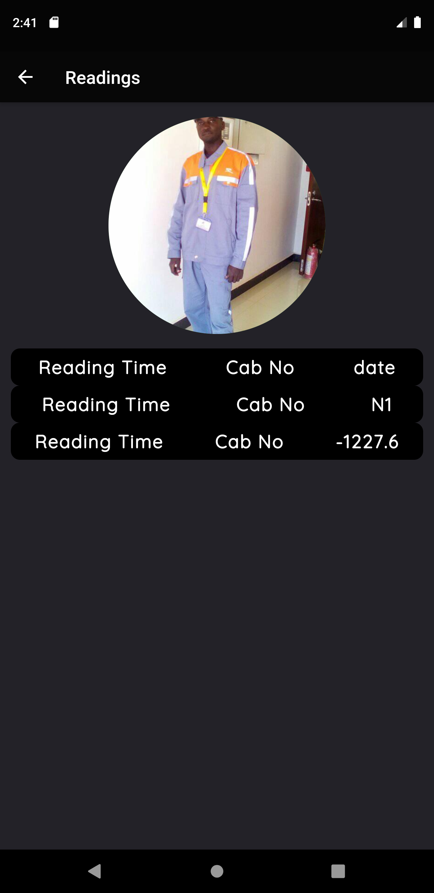

<h1>Substation App</h1>
<h2>A tool Created to help me with my Daily Workload</h2>

each an everyday i calculate daily usage of electricity  and sometimes is boring cause is reptitive so i created this app to help me do my calculation as am learning flutter  

<h3>I have Learnt the following</h3>
<ul>
    <li>Use of Stateful Widgets &Stateless Widgets </li>
    <li>Functions</li>
    <li>Object Oriented Programimg</li>
    <li>Using Fonts From External Libraries</li>
    <li>How to use Pub.get and depedencies from <a href="https:Pub.dev">Pub.dev</a> </li>
</ul>
<h4>Here ScreenShots</h4>

